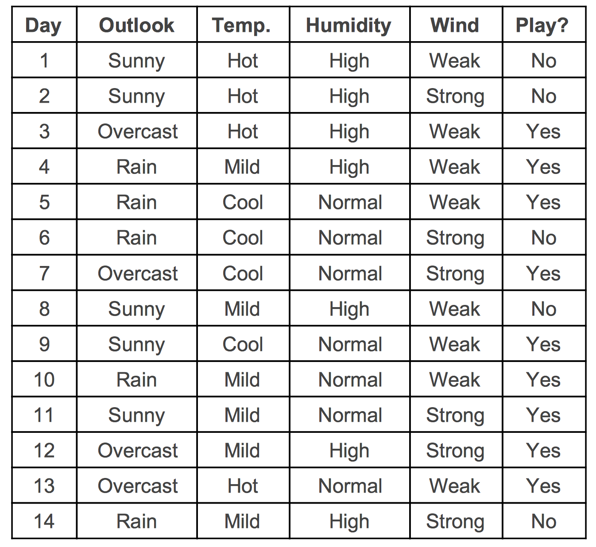
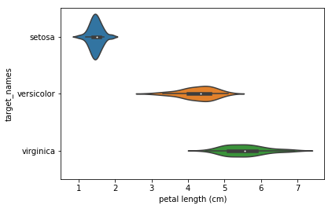
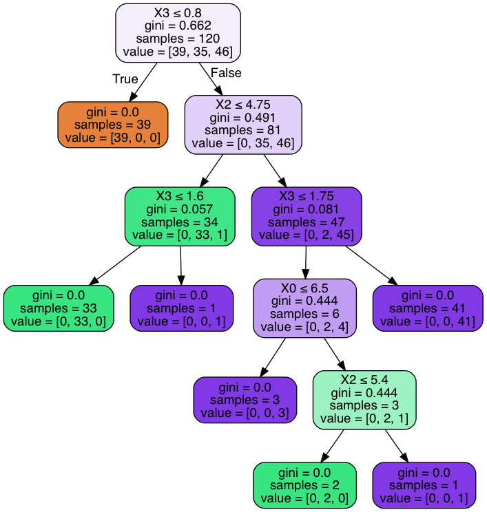
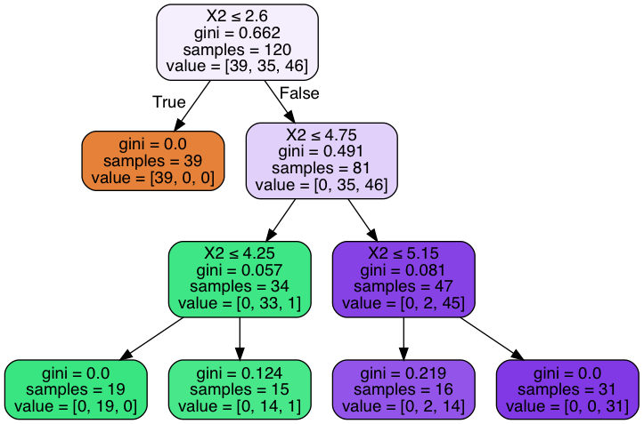
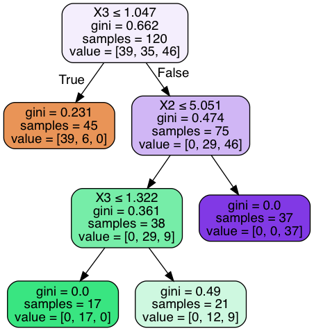
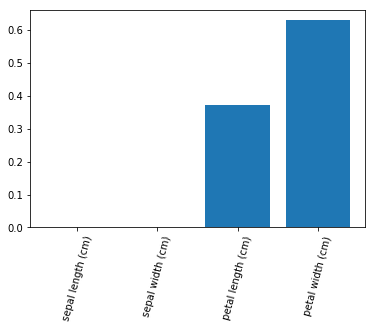

### Questions

### Objectives
* Build a decision tree classifier using sklearn
* Analyze and improve decision tree classifier iteratively
* Apply best practices to decision trees

### What are the parts of a decision tree?
Nodes and Edges


# The Scenario
- You are given the following data and asked to predict if someone will play outside or not based on the features



### What is a Gini Index and What is Entropy?


```python
# Calculate the gini index for humidity (high (1)  or normal (0))
# gini index -> purity of a split (are we dividing play_yes and play_no well?)
# 0 = normal, 1 = high
no_play_humidity = [1, 1, 0, 1, 1] # P(Humid|0) = 0.80
yes_play_humidity = [1, 1, 0, 0, 0, 0, 0, 1, 0] # P(Humid|1) = 3/9


# P(normal humidity|no play)
no_normal = 0.20 # 1 out 5 -> 0.20^2 = 0.04
# P(high humidity | no play) 
no_high = 0.80 # 4 out of 5 -> 0.80^2 = 0.64

# P(normal humdity | yes play)
yes_normal = 6.0/9.0 # 0.6666....
# P(high humidity | yes play)
yes_high = 3.0/9.0 # 0.33333.....


# calculate the purity of the 'no' data
g_nos = no_normal**2 + no_high**2  # 0.68

# what does it mean if g_nos << 1
# the feature is evenly represented in our target (which is bad)

# what does it mean if g_nos~1?
# splitting our target and looking at our feature, we see a feature value that is more dominant


# g ~ 1 both numbers must be small (close)
# g ~ 0 one condition has really high probability
g_nos = 1 - g_nos

g_yes = yes_normal**2 + yes_high**2 # 0.5555....
g_yes = 1 - g_yes


# gini ~ 1 this means really really impure split
# gini ~ 0 this means really really pure split
# weighted average
gini = g_nos * (5/14) + g_yes*(9/14)
print("g_humid = {}".format(gini))
```

    g_humid = 0.3999999999999999


# Are there any pros/cons that you're noticing with this? 
* Pros
    * Columns don't necessarily need to be independent (but in ds you want them to be)
    * Multicollinearity is no longer a thing
* Cons
    * Low sample size leads to high variability
    * Low sample sizes leads to bias
    * Greedy/Overfitting

### Outline
* Discuss Gini Index/Entropy
* Build a Decision Tree
* Visualize It


```python
import pandas as pd
import numpy as np

import scipy

from sklearn.tree import DecisionTreeClassifier, export_graphviz
from sklearn.datasets import load_iris
from sklearn.metrics import classification_report, confusion_matrix
from sklearn.model_selection import train_test_split
from sklearn.feature_selection import SelectKBest


import matplotlib.pyplot as plt
import seaborn as sns
```


```python
def create_df_load_set(load_set):
    dataset = load_set()
    data = dataset.data
    columns = dataset.feature_names
    target = dataset.target
    target_names = dataset.target_names
    df = pd.DataFrame(data, columns=columns)
    df['target'] = target
    df['target_names'] = [target_names[i] for i in target]
    return df
```


```python
df = create_df_load_set(load_iris)
df.head()
```


<div>
<style scoped>
    .dataframe tbody tr th:only-of-type {
        vertical-align: middle;
    }

    .dataframe tbody tr th {
        vertical-align: top;
    }

    .dataframe thead th {
        text-align: right;
    }
</style>
<table border="1" class="dataframe">
  <thead>
    <tr style="text-align: right;">
      <th></th>
      <th>sepal length (cm)</th>
      <th>sepal width (cm)</th>
      <th>petal length (cm)</th>
      <th>petal width (cm)</th>
      <th>target</th>
      <th>target_names</th>
    </tr>
  </thead>
  <tbody>
    <tr>
      <td>0</td>
      <td>5.1</td>
      <td>3.5</td>
      <td>1.4</td>
      <td>0.2</td>
      <td>0</td>
      <td>setosa</td>
    </tr>
    <tr>
      <td>1</td>
      <td>4.9</td>
      <td>3.0</td>
      <td>1.4</td>
      <td>0.2</td>
      <td>0</td>
      <td>setosa</td>
    </tr>
    <tr>
      <td>2</td>
      <td>4.7</td>
      <td>3.2</td>
      <td>1.3</td>
      <td>0.2</td>
      <td>0</td>
      <td>setosa</td>
    </tr>
    <tr>
      <td>3</td>
      <td>4.6</td>
      <td>3.1</td>
      <td>1.5</td>
      <td>0.2</td>
      <td>0</td>
      <td>setosa</td>
    </tr>
    <tr>
      <td>4</td>
      <td>5.0</td>
      <td>3.6</td>
      <td>1.4</td>
      <td>0.2</td>
      <td>0</td>
      <td>setosa</td>
    </tr>
  </tbody>
</table>
</div>


```python
df.target_names.unique()
```


    array(['setosa', 'versicolor', 'virginica'], dtype=object)


### Let's discuss multicollinearity of decision trees


```python
df.corr()
```


<div>
<style scoped>
    .dataframe tbody tr th:only-of-type {
        vertical-align: middle;
    }

    .dataframe tbody tr th {
        vertical-align: top;
    }

    .dataframe thead th {
        text-align: right;
    }
</style>
<table border="1" class="dataframe">
  <thead>
    <tr style="text-align: right;">
      <th></th>
      <th>sepal length (cm)</th>
      <th>sepal width (cm)</th>
      <th>petal length (cm)</th>
      <th>petal width (cm)</th>
      <th>target</th>
    </tr>
  </thead>
  <tbody>
    <tr>
      <td>sepal length (cm)</td>
      <td>1.000000</td>
      <td>-0.117570</td>
      <td>0.871754</td>
      <td>0.817941</td>
      <td>0.782561</td>
    </tr>
    <tr>
      <td>sepal width (cm)</td>
      <td>-0.117570</td>
      <td>1.000000</td>
      <td>-0.428440</td>
      <td>-0.366126</td>
      <td>-0.426658</td>
    </tr>
    <tr>
      <td>petal length (cm)</td>
      <td>0.871754</td>
      <td>-0.428440</td>
      <td>1.000000</td>
      <td>0.962865</td>
      <td>0.949035</td>
    </tr>
    <tr>
      <td>petal width (cm)</td>
      <td>0.817941</td>
      <td>-0.366126</td>
      <td>0.962865</td>
      <td>1.000000</td>
      <td>0.956547</td>
    </tr>
    <tr>
      <td>target</td>
      <td>0.782561</td>
      <td>-0.426658</td>
      <td>0.949035</td>
      <td>0.956547</td>
      <td>1.000000</td>
    </tr>
  </tbody>
</table>
</div>


### What do we notice about the correlation matrix?


```python
x, y = df.drop(['target', 'target_names'], axis=1), df.target_names
```


```python
xtrain, xtest, ytrain, ytest = train_test_split(x, y, train_size=0.80)
```

### Let's build a decision tree


```python
clf = DecisionTreeClassifier() # Betty Crocker DT
clf.fit(xtrain, ytrain)
```


    DecisionTreeClassifier(ccp_alpha=0.0, class_weight=None, criterion='gini',
                           max_depth=None, max_features=None, max_leaf_nodes=None,
                           min_impurity_decrease=0.0, min_impurity_split=None,
                           min_samples_leaf=1, min_samples_split=2,
                           min_weight_fraction_leaf=0.0, presort='deprecated',
                           random_state=None, splitter='best')


```python
clf.score(xtrain, ytrain)
```


    1.0


```python
clf.score(xtest, ytest) # train score = 100% -> overfitting on training data

```


    0.9


### Let's visualize our tree
[Source is Medium Article](https://medium.com/@rnbrown/creating-and-visualizing-decision-trees-with-python-f8e8fa394176)


```python
from sklearn.externals.six import StringIO  
from IPython.display import Image  
from sklearn.tree import export_graphviz
from sklearn.metrics import accuracy_score
import pydotplus
```

    /Users/rafael/anaconda3/envs/flatiron-env/lib/python3.6/site-packages/sklearn/externals/six.py:31: FutureWarning: The module is deprecated in version 0.21 and will be removed in version 0.23 since we've dropped support for Python 2.7. Please rely on the official version of six (https://pypi.org/project/six/).
      "(https://pypi.org/project/six/).", FutureWarning)


```python
df.columns
```


    Index(['sepal length (cm)', 'sepal width (cm)', 'petal length (cm)',
           'petal width (cm)', 'target', 'target_names'],
          dtype='object')


```python
col = df.columns[2]
sns.violinplot(x=col, y='target_names', data=df)
```


    <matplotlib.axes._subplots.AxesSubplot at 0x1a27870dd8>





```python
dot_data = StringIO()
export_graphviz(clf, out_file=dot_data,  
                filled=True, rounded=True,
                special_characters=True)
graph = pydotplus.graph_from_dot_data(dot_data.getvalue())  
Image(graph.create_png())
```





### the depth of the search is leading overfitting
### the multicollinearity could lead to overfitting...lead bias

### If you're increasing robustness but test score stays stagnant, what does this indicate?

### Let's tune some hyperparameters


```python
clf = DecisionTreeClassifier(min_samples_leaf=int(df.shape[0]/10))
clf.fit(xtrain, ytrain)
```


    DecisionTreeClassifier(ccp_alpha=0.0, class_weight=None, criterion='gini',
                           max_depth=None, max_features=None, max_leaf_nodes=None,
                           min_impurity_decrease=0.0, min_impurity_split=None,
                           min_samples_leaf=15, min_samples_split=2,
                           min_weight_fraction_leaf=0.0, presort='deprecated',
                           random_state=None, splitter='best')


```python
clf.score(xtrain, ytrain)
```


    0.875


```python
clf.score(xtest, ytest) # train score = 96% -> overfitting on training data
```


    0.9333333333333333


```python
dot_data = StringIO()
export_graphviz(clf, out_file=dot_data,  
                filled=True, rounded=True,
                special_characters=True)
graph = pydotplus.graph_from_dot_data(dot_data.getvalue())  
Image(graph.create_png())
```





### Still have splits that are overfitting 'chasing' points.


```python
clf = DecisionTreeClassifier(criterion='gini', 
                             splitter='random', 
                             min_samples_leaf=int(xtrain.shape[0]/10), 
                             max_depth=3)
clf.fit(xtrain, ytrain)
```


    DecisionTreeClassifier(ccp_alpha=0.0, class_weight=None, criterion='gini',
                           max_depth=3, max_features=None, max_leaf_nodes=None,
                           min_impurity_decrease=0.0, min_impurity_split=None,
                           min_samples_leaf=12, min_samples_split=2,
                           min_weight_fraction_leaf=0.0, presort='deprecated',
                           random_state=None, splitter='random')


```python
clf.score(xtrain, ytrain)
```


    0.875


```python
clf.score(xtest, ytest) # train score = 96% -> overfitting on training data
```


    0.9333333333333333


```python
dot_data = StringIO()
export_graphviz(clf, out_file=dot_data,  
                filled=True, rounded=True,
                special_characters=True)
graph = pydotplus.graph_from_dot_data(dot_data.getvalue())  
Image(graph.create_png())
```





### We tuned some hyperparameters, now let's look at attributes


```python
feature_importance_vals = clf.feature_importances_
features = x.columns
feature_importance_vals, features
```


    (array([0.        , 0.        , 0.37138394, 0.62861606]),
     Index(['sepal length (cm)', 'sepal width (cm)', 'petal length (cm)',
            'petal width (cm)'],
           dtype='object'))


```python
plt.bar(features, feature_importance_vals)
plt.xticks(features, features, rotation=75)
plt.show()
```





```python
from sklearn.preprocessing import OneHotEncoder
```


```python
encoder = OneHotEncoder()
```


```python
encoder.fit(y.values.reshape(-1, 1))
```


    OneHotEncoder(categories='auto', drop=None, dtype=<class 'numpy.float64'>,
                  handle_unknown='error', sparse=True)


```python
ytest_enc = encoder.transform(ytest.values.reshape(-1, 1))
ytest_enc
```


    <30x3 sparse matrix of type '<class 'numpy.float64'>'
    	with 30 stored elements in Compressed Sparse Row format>


```python
y_score = clf.predict_proba(xtest)
y_score
```


    array([[0.        , 1.        , 0.        ],
           [0.        , 1.        , 0.        ],
           [0.86666667, 0.13333333, 0.        ],
           [0.86666667, 0.13333333, 0.        ],
           [0.        , 0.57142857, 0.42857143],
           [0.        , 1.        , 0.        ],
           [0.        , 0.57142857, 0.42857143],
           [0.86666667, 0.13333333, 0.        ],
           [0.        , 0.57142857, 0.42857143],
           [0.86666667, 0.13333333, 0.        ],
           [0.        , 1.        , 0.        ],
           [0.        , 0.57142857, 0.42857143],
           [0.        , 0.        , 1.        ],
           [0.86666667, 0.13333333, 0.        ],
           [0.        , 0.57142857, 0.42857143],
           [0.86666667, 0.13333333, 0.        ],
           [0.        , 0.        , 1.        ],
           [0.        , 0.57142857, 0.42857143],
           [0.        , 0.57142857, 0.42857143],
           [0.86666667, 0.13333333, 0.        ],
           [0.86666667, 0.13333333, 0.        ],
           [0.86666667, 0.13333333, 0.        ],
           [0.        , 0.57142857, 0.42857143],
           [0.        , 0.        , 1.        ],
           [0.86666667, 0.13333333, 0.        ],
           [0.86666667, 0.13333333, 0.        ],
           [0.        , 0.        , 1.        ],
           [0.        , 0.        , 1.        ],
           [0.86666667, 0.13333333, 0.        ],
           [0.        , 0.57142857, 0.42857143]])


```python
setosas = ytest_enc[:, 0]
```


```python
setosas.todense().ravel()
y_score[:, 0]
```


    array([0.        , 0.        , 0.86666667, 0.86666667, 0.        ,
           0.        , 0.        , 0.86666667, 0.        , 0.86666667,
           0.        , 0.        , 0.        , 0.86666667, 0.        ,
           0.86666667, 0.        , 0.        , 0.        , 0.86666667,
           0.86666667, 0.86666667, 0.        , 0.        , 0.86666667,
           0.86666667, 0.        , 0.        , 0.86666667, 0.        ])


```python
from sklearn.metrics import roc_auc_score, roc_curve
fpr = dict()
tpr = dict()
roc_auc = dict()


for i in range(3):
    actuals = ytest_enc[:, i]
    actuals = actuals.todense().ravel()
    fpr[i], tpr[i], _ = roc_curve(actuals, y_score[:, i].ravel())
    roc_auc[i] = auc(fpr[i], tpr[i])

# Compute micro-average ROC curve and ROC area
fpr["micro"], tpr["micro"], _ = roc_curve(y_test.ravel(), y_score.ravel())
roc_auc["micro"] = auc(fpr["micro"], tpr["micro"])
```


    ---------------------------------------------------------------------------

    ValueError                                Traceback (most recent call last)

    <ipython-input-80-30eb052caa16> in <module>
          8     actuals = ytest_enc[:, i]
          9     actuals = actuals.todense().ravel()
    ---> 10     fpr[i], tpr[i], _ = roc_curve(actuals, y_score[:, i].ravel())
         11     roc_auc[i] = auc(fpr[i], tpr[i])
         12 


    ~/anaconda3/envs/flatiron-env/lib/python3.6/site-packages/sklearn/metrics/_ranking.py in roc_curve(y_true, y_score, pos_label, sample_weight, drop_intermediate)
        769     """
        770     fps, tps, thresholds = _binary_clf_curve(
    --> 771         y_true, y_score, pos_label=pos_label, sample_weight=sample_weight)
        772 
        773     # Attempt to drop thresholds corresponding to points in between and


    ~/anaconda3/envs/flatiron-env/lib/python3.6/site-packages/sklearn/metrics/_ranking.py in _binary_clf_curve(y_true, y_score, pos_label, sample_weight)
        534     if not (y_type == "binary" or
        535             (y_type == "multiclass" and pos_label is not None)):
    --> 536         raise ValueError("{0} format is not supported".format(y_type))
        537 
        538     check_consistent_length(y_true, y_score, sample_weight)


    ValueError: multilabel-indicator format is not supported


### Multicollinearity makes feature importances impossible to interpret


```python
scipy.sparse.csr_matrix.todense(clf.decision_path(xtest)) # SHOWS THE NODES THAT INTERACT WITH EACH X VALUE AS 1
```


    matrix([[1, 0, 1, 0, 0, 0, 1],
            [1, 1, 0, 0, 0, 0, 0],
            [1, 0, 1, 0, 0, 0, 1],
            [1, 0, 1, 0, 0, 0, 1],
            [1, 0, 1, 1, 0, 1, 0],
            [1, 0, 1, 0, 0, 0, 1],
            [1, 0, 1, 1, 0, 1, 0],
            [1, 0, 1, 1, 0, 1, 0],
            [1, 1, 0, 0, 0, 0, 0],
            [1, 1, 0, 0, 0, 0, 0],
            [1, 0, 1, 1, 0, 1, 0],
            [1, 0, 1, 1, 0, 1, 0],
            [1, 0, 1, 1, 1, 0, 0],
            [1, 1, 0, 0, 0, 0, 0],
            [1, 1, 0, 0, 0, 0, 0],
            [1, 0, 1, 1, 1, 0, 0],
            [1, 0, 1, 1, 1, 0, 0],
            [1, 0, 1, 0, 0, 0, 1],
            [1, 1, 0, 0, 0, 0, 0],
            [1, 1, 0, 0, 0, 0, 0],
            [1, 0, 1, 1, 0, 1, 0],
            [1, 0, 1, 0, 0, 0, 1],
            [1, 0, 1, 1, 0, 1, 0],
            [1, 0, 1, 1, 1, 0, 0],
            [1, 0, 1, 1, 0, 1, 0],
            [1, 1, 0, 0, 0, 0, 0],
            [1, 0, 1, 1, 1, 0, 0],
            [1, 1, 0, 0, 0, 0, 0],
            [1, 0, 1, 1, 0, 1, 0],
            [1, 0, 1, 1, 0, 1, 0]])


```python
xtest.shape
```


    (30, 4)


```python
xtest.iloc[0]
```


    sepal length (cm)    6.0
    sepal width (cm)     2.2
    petal length (cm)    5.0
    petal width (cm)     1.5
    Name: 119, dtype: float64


```python
clf.predict(xtest.iloc[0].values.reshape(1, -1))
```


    array([1])


### Assessment
* Learned about overfitting decision trees - prone to overfitting
* Tuning hyperparameters
* Pruning the tree can prevent overfitting
    * Prune by limiting depth or limiting splits size requirements
* Assessing and taking actions from feature importances
