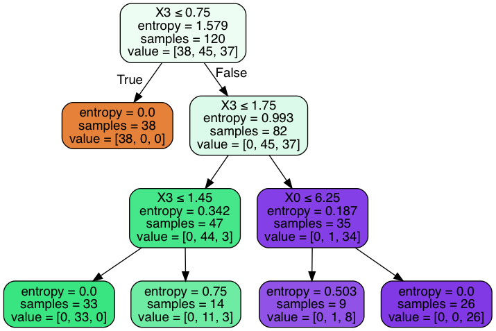
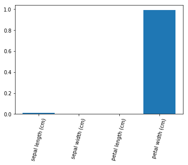

### Objectives
* Build a decision tree classifier using sklearn
* Analyze and improve decision tree classifier iteratively
* Apply best practices to decision trees

### What is a Gini Index and What is Entropy?
* Entropy - Checking for how messy data is...looking at how many different classifiers are in a population of data.
* Entropy - Measure of disorder
* High Entropy -> Low Information Gain
* High Entropy -> Low Separability
* Gini Index - Measurement of the purity of a split
    * Gini Index Low -> High Purity

* What is typically picked for the Root Node of a Decision Tree
    * 'Best Predictor' - Whatever feature is most important ~ feature with the highest purity (information gain)
* After that your splits should have higher purity as the tree goes down.

### Outline
* Discuss Gini Index/Entropy
* Build a Decision Tree
* Visualize It


```python
import pandas as pd
import numpy as np

import scipy

from sklearn.tree import DecisionTreeClassifier, export_graphviz
from sklearn.datasets import load_iris
from sklearn.metrics import classification_report, confusion_matrix
from sklearn.model_selection import train_test_split
from sklearn.feature_selection import SelectKBest


import matplotlib.pyplot as plt
import seaborn as sns
```


```python
def create_df_load_set(load_set):
    dataset = load_set()
    data = dataset.data
    columns = dataset.feature_names
    target = dataset.target
    df = pd.DataFrame(data, columns=columns)
    df['target'] = target
    return df
```


```python
df = create_df_load_set(load_iris)
df.head()
```


<div>
<style scoped>
    .dataframe tbody tr th:only-of-type {
        vertical-align: middle;
    }

    .dataframe tbody tr th {
        vertical-align: top;
    }

    .dataframe thead th {
        text-align: right;
    }
</style>
<table border="1" class="dataframe">
  <thead>
    <tr style="text-align: right;">
      <th></th>
      <th>sepal length (cm)</th>
      <th>sepal width (cm)</th>
      <th>petal length (cm)</th>
      <th>petal width (cm)</th>
      <th>target</th>
    </tr>
  </thead>
  <tbody>
    <tr>
      <th>0</th>
      <td>5.1</td>
      <td>3.5</td>
      <td>1.4</td>
      <td>0.2</td>
      <td>0</td>
    </tr>
    <tr>
      <th>1</th>
      <td>4.9</td>
      <td>3.0</td>
      <td>1.4</td>
      <td>0.2</td>
      <td>0</td>
    </tr>
    <tr>
      <th>2</th>
      <td>4.7</td>
      <td>3.2</td>
      <td>1.3</td>
      <td>0.2</td>
      <td>0</td>
    </tr>
    <tr>
      <th>3</th>
      <td>4.6</td>
      <td>3.1</td>
      <td>1.5</td>
      <td>0.2</td>
      <td>0</td>
    </tr>
    <tr>
      <th>4</th>
      <td>5.0</td>
      <td>3.6</td>
      <td>1.4</td>
      <td>0.2</td>
      <td>0</td>
    </tr>
  </tbody>
</table>
</div>


```python
df.target.unique()
```


    array([0, 1, 2])


### Let's discuss multicollinearity of decision trees


```python
df.corr()
```


<div>
<style scoped>
    .dataframe tbody tr th:only-of-type {
        vertical-align: middle;
    }

    .dataframe tbody tr th {
        vertical-align: top;
    }

    .dataframe thead th {
        text-align: right;
    }
</style>
<table border="1" class="dataframe">
  <thead>
    <tr style="text-align: right;">
      <th></th>
      <th>sepal length (cm)</th>
      <th>sepal width (cm)</th>
      <th>petal length (cm)</th>
      <th>petal width (cm)</th>
      <th>target</th>
    </tr>
  </thead>
  <tbody>
    <tr>
      <th>sepal length (cm)</th>
      <td>1.000000</td>
      <td>-0.117570</td>
      <td>0.871754</td>
      <td>0.817941</td>
      <td>0.782561</td>
    </tr>
    <tr>
      <th>sepal width (cm)</th>
      <td>-0.117570</td>
      <td>1.000000</td>
      <td>-0.428440</td>
      <td>-0.366126</td>
      <td>-0.426658</td>
    </tr>
    <tr>
      <th>petal length (cm)</th>
      <td>0.871754</td>
      <td>-0.428440</td>
      <td>1.000000</td>
      <td>0.962865</td>
      <td>0.949035</td>
    </tr>
    <tr>
      <th>petal width (cm)</th>
      <td>0.817941</td>
      <td>-0.366126</td>
      <td>0.962865</td>
      <td>1.000000</td>
      <td>0.956547</td>
    </tr>
    <tr>
      <th>target</th>
      <td>0.782561</td>
      <td>-0.426658</td>
      <td>0.949035</td>
      <td>0.956547</td>
      <td>1.000000</td>
    </tr>
  </tbody>
</table>
</div>


### What do we notice about the correlation matrix?
- petalwidth has highest correlation with target
- we have multicollinearity with petal length and petal width
- sepal length and petal length and petal width


### Is that a problem?
- In Linear Regression this is a problem
- In Logistic Regression this is also a problem

- Mathematically, multicollinearity isn't an issue for non parametric methods. 
- Determine that your data is conditioned


```python
x, y = df.drop(['target'], axis=1), df.target
```


```python
xtrain, xtest, ytrain, ytest = train_test_split(x, y, train_size=0.80)
```

### Let's build a decision tree


```python
clf = DecisionTreeClassifier(criterion='entropy', max_depth=4, min_samples_split=10, min_samples_leaf=8)
clf.fit(xtrain, ytrain)
```


    DecisionTreeClassifier(class_weight=None, criterion='entropy', max_depth=4,
                           max_features=None, max_leaf_nodes=None,
                           min_impurity_decrease=0.0, min_impurity_split=None,
                           min_samples_leaf=8, min_samples_split=10,
                           min_weight_fraction_leaf=0.0, presort=False,
                           random_state=None, splitter='best')


```python
clf.score(xtrain, ytrain)
```


    0.9666666666666667


```python
clf.score(xtest, ytest) # train score = 100% -> overfitting on training data


```


    0.9333333333333333


### Let's visualize our tree
[Source is Medium Article](https://medium.com/@rnbrown/creating-and-visualizing-decision-trees-with-python-f8e8fa394176)


```python
from sklearn.externals.six import StringIO  
from IPython.display import Image  
from sklearn.tree import export_graphviz
import pydotplus
```

    /anaconda3/lib/python3.7/site-packages/sklearn/externals/six.py:31: DeprecationWarning: The module is deprecated in version 0.21 and will be removed in version 0.23 since we've dropped support for Python 2.7. Please rely on the official version of six (https://pypi.org/project/six/).
      "(https://pypi.org/project/six/).", DeprecationWarning)


```python
dot_data = StringIO()
export_graphviz(clf, out_file=dot_data,  
                filled=True, rounded=True,
                special_characters=True)
graph = pydotplus.graph_from_dot_data(dot_data.getvalue())  
Image(graph.create_png())
```





### If you're increasing robustness but test score stays stagnant, what does this indicate?

### We tuned some hyperparameters, now let's look at attributes


```python
feature_importance_vals = clf.feature_importances_
features = x.columns
```


```python
plt.bar(features, feature_importance_vals)
plt.xticks(features, features, rotation=75)
plt.show()
```





```python
scipy.sparse.csr_matrix.todense(clf.decision_path(xtest)) # SHOWS THE NODES THAT INTERACT WITH EACH X VALUE AS 1
```


    matrix([[1, 0, 1, 1, 0, 0, 0, 1, 0, 0, 0],
            [1, 1, 0, 0, 0, 0, 0, 0, 0, 0, 0],
            [1, 0, 1, 1, 1, 0, 1, 0, 0, 0, 0],
            [1, 0, 1, 1, 1, 1, 0, 0, 0, 0, 0],
            [1, 0, 1, 1, 1, 1, 0, 0, 0, 0, 0],
            [1, 0, 1, 0, 0, 0, 0, 0, 1, 0, 1],
            [1, 0, 1, 1, 1, 1, 0, 0, 0, 0, 0],
            [1, 1, 0, 0, 0, 0, 0, 0, 0, 0, 0],
            [1, 1, 0, 0, 0, 0, 0, 0, 0, 0, 0],
            [1, 1, 0, 0, 0, 0, 0, 0, 0, 0, 0],
            [1, 0, 1, 0, 0, 0, 0, 0, 1, 0, 1],
            [1, 0, 1, 1, 1, 1, 0, 0, 0, 0, 0],
            [1, 1, 0, 0, 0, 0, 0, 0, 0, 0, 0],
            [1, 1, 0, 0, 0, 0, 0, 0, 0, 0, 0],
            [1, 0, 1, 1, 1, 0, 1, 0, 0, 0, 0],
            [1, 0, 1, 0, 0, 0, 0, 0, 1, 0, 1],
            [1, 0, 1, 0, 0, 0, 0, 0, 1, 0, 1],
            [1, 1, 0, 0, 0, 0, 0, 0, 0, 0, 0],
            [1, 0, 1, 0, 0, 0, 0, 0, 1, 0, 1],
            [1, 1, 0, 0, 0, 0, 0, 0, 0, 0, 0],
            [1, 0, 1, 0, 0, 0, 0, 0, 1, 0, 1],
            [1, 0, 1, 0, 0, 0, 0, 0, 1, 0, 1],
            [1, 1, 0, 0, 0, 0, 0, 0, 0, 0, 0],
            [1, 0, 1, 1, 1, 1, 0, 0, 0, 0, 0],
            [1, 0, 1, 1, 1, 1, 0, 0, 0, 0, 0],
            [1, 0, 1, 0, 0, 0, 0, 0, 1, 1, 0],
            [1, 0, 1, 1, 1, 1, 0, 0, 0, 0, 0],
            [1, 0, 1, 0, 0, 0, 0, 0, 1, 0, 1],
            [1, 1, 0, 0, 0, 0, 0, 0, 0, 0, 0],
            [1, 0, 1, 0, 0, 0, 0, 0, 1, 0, 1]])


```python
xtest.shape
```


    (30, 4)


```python
xtest.iloc[0]
```


    sepal length (cm)    6.0
    sepal width (cm)     2.2
    petal length (cm)    5.0
    petal width (cm)     1.5
    Name: 119, dtype: float64


```python
clf.predict(xtest.iloc[0].values.reshape(1, -1))
```


    array([1])


### Assessment
* Learned about overfitting decision trees - prone to overfitting
* Tuning hyperparameters
* Pruning the tree can prevent overfitting
    * Prune by limiting depth or limiting splits size requirements
* Assessing and taking actions from feature importances
